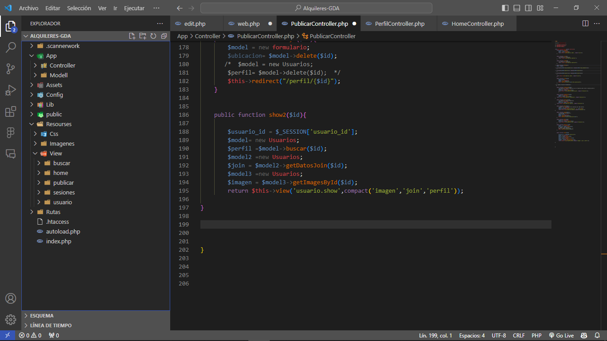

<h1 align="center">Hi! I'm JuanFer Dev 💻</h1>

  

<!--Intro start-->

- 🏠 Also We've a StartUp [Alquileres Guaranda](https://www.alquileresguaranda.com).
  
- 🔭 I’m currently working on **AWS, React, React Native, Nodejs, MySql**

- 🌱 I’m currently learning **Generative images with Python.**

- ☁️ I've keen interest in cloud computing. So,I'm learning **AWS, Google Cloud**

- 📽 I currently upload videos to YouTube about technologies and tutorials [Youtube](https://www.youtube.com/@Juanferdev)

- 📫 Feel free to reach me out **juanfermain0@gmail.com**
  
- 🙏  Thanks for being here
<!--Intro end-->
#  Projects ⚙️
<table bordercolor="#66b2b2">
  
  <tr>
    <td width="50%" valign="top">
      <h3 align="center">Alquileres Guaranda</h3>
         
        
         
        

           
        

        
        
        
        
        
        

      
 
<strong>Laravel 10, Tailwindccs, Sass, & Solidity</strong> - Alquileres Guaranda : Alquileres Guaranda is a marketplace for publishing rental properties.

    </td>
    <td width="50%" valign="top">
      <h3 align="center">Mi propio Framework PHP</h3>
         
      
         
        

    
   
    
     

        
<strong>PHP, Html, CSS, JavaScript</strong> - Mi framework PHP : A web Page with MVC Pattern from scratch, developed in 2023, last university season

    </td>
  </tr>
  
  
</table>

<h1 align="left">Tech Stack</h1>

<!--tech stack icons-->

  

<h1 align="left"> Github stadistics</h1>
<!--GitHub Stats-->

|
|---|---|
|
